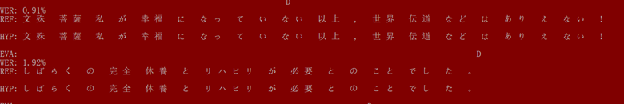

### Maxmatch.py
##### Description
This Maxmatch algorithm has been created to run on texts written in Japanese. Maxmatch reads in lines from the text file (from left to right) and compares them to words stored in a dictionary. More specifically, it reads the first character in the line and looks for a match in the dictionary. If there is no match, it prints that as a word. If there is a match, it continues looking for as many character matches in a row as it can and prints that as a word. After it prints, it then reruns the function with the rest of the line. 

##### Usage
The tokenized dictionary that maxmatch compares input to is stored inside the maxmatch.py file. Because of this, type the name of th efile you'd like to tokenize into the command line. For example: ```$ python3 maxmatch.py name_of_text_file.txt```

##### Effectiveness
Running [wer.py](https://github.com/zszyellow/WER-in-python) to check Word Error Rate (WER) on 543 lines of Japanese text, the final WER was was 0.0061. 


