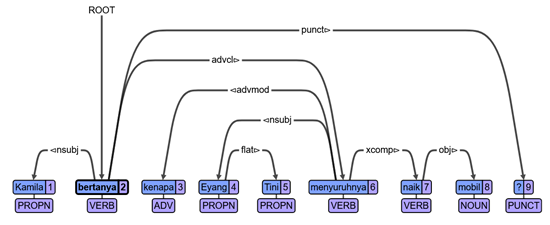

# Inspect 10 sentences: What errors were made?

## Sentence 1

Baler adalah munisipalitas yang terletak di provinsi Aurora, Filipina.
Word-by-word translation:
Baler is municipality that located in province Aurora, Philippines.
This tree appears to be well-formed. “munisipalitas” is the head of the predicate and should therefore be the root. The subject (Baler) and copula verb branch out from the root. “Terletak” stems out of “municipalitas” and forms the head of a new clause.  

## Sentence 2

Pencurian dan perampokan juga sangat jarang terjadi di wilayah ini.
Word-by-word translation:
Theft and robbery also very rarely happen/occur in region this. 
The root of this tree is appropriate. “Terjadi” is the root of the tree because it’s the head of the predicate. It also has correctly grouped “juga sangat jarang” (also very rarely) with the root because they are part of the predicate. The subject also looks correct. There are two nouns in the subject joined by “dan” (and). The first noun takes the second one as a dependent, and the second noun takes the conjunction as its dependent.  

## Sentence 3

Laut Sulawesi merupakan     tempat bagi banyak spesies ikan dan makhluk bawah air.
Word-by-word translation:
Sea Sulawesi is-composed-of place for   many species fish and creature under water

I’m not sure if the root is correct here. “Merupakan” is a copula verb meaning “is composed of/constitutes”, so “tempat….I don’t know. Maybe it is all good?

## Sentence 4

Bahkan ia menolak telah menikah dan memiliki anak dari Sakuntala.
Word-for-word translation:
In fact he  refused  has(pres.perf) marry and have child from Sakuntala. 

The only thing I questioned about this tree was “dari” (from) being called a “case” marker. This struck me because nouns aren’t modified for case in Indonesian. However, the CONLLU website says, “Case can also be a lexical feature of adpositions and describe the case meaning that the adposition contributes to the nominal in which it appears. (This usage of the feature is typical for languages that do not have case morphology on nouns….” Because of this, I would not disagree with the tree. 

## Sentence 5

Ramanuja adalah seorang teolog, filsuf, dan juga penafsir kitab suci Hindu. 
Word-by-word translation:
Ramanuja   is               a	   theologian, philosopher, and interpreter (holy-)book holy Hundi. 
I agree with this tree. “Adalah” (is) is the start of the predicate, but, because it’s a copula verb, the root is “teolog” (theologian). While “theologian, philosopher, and interpreter” is a noun phrase, “theologian is the root simply because it’s the first noun in the phrase. The other two nouns are connected to “theologian directly, and the conjunction “dan” is linked to the final noun in the phrase. I agree with this interpretation. The only thing I disagree with is “kitab” as a compound noun with “penafsir”. I believe “suci” is an adjective modifying “kitab” but “kitab” does not form a compound noun with “penafsir”. 

## Sentence 6

Kamila bertanya kenapa Eyang Tini menyuruhnya naik mobil?
Word-by-word translation:
Kamila asked why Grandma Tini told her to get in the car? 
This tree looks appropriate. “Bertanya” is a verb meaning “to question”, and it should be the root of the tree. “kenapa” is an adverb modifying “menyuruhnya” (told him). So an arrow is drawn to “kenapa” because it depends on the verb.  “Eyang Tini” (Grandma Tini) is marked as “flat” because it is a NP without a head.  

## Sentence 7

Sementara itu, seorang pelawak merayu seorang pembantu rumah tangga.
While that, a comedian seduces a maid household. 
Even though this tree has a scary red line, it looks okay. The scary red line seems to be because after the adverb phrase “semantara itu” (translating to “meanwhile”), there is a comma. Punctuation usually always depends on the verb, but in this case, it depends on this adverb phrase. I would also disagree with calling “sementara itu” a conjunction + determiner. “Itu” is a determiner meaning “that”, but “sementara” should be labelled as an adverb. Then the arrow marking “sementara” as a dependent o “merayu” should be labelled “mark” instead of “cc” because it’s actually a subordinating conjunction instead of a coordinating conjunction. 

## Sentence 8

Karakter utama di permainan ini bernama Claude Speed.
Character main in game this named Calude Speed. 
The root is appropriate in this tree: “bernama” (“is named”). The NP “karakter utama” (“main character”) is governed by the root as well as the object “Clause Speed”. Because “Claude Speed” is a proper noun, it is headless and therefore marked as “flat”. 

## Sentence 9

Desa ini memiliki kodepos 86262.
Gloss:
Village this has postal code 86262.

This tree is beautiful. The main verb “memiliki” (“to possess”) is the root. It governs the subject “desa” (village”) and the object in the predicate (“postal code 86262”).  

## Sentence 10

Dan bagaimanakah kamu lihat keadaannya sekarang?
Gloss
And  how                  you     see (his/her/its circumstance) now?
“Dan” marks the beginning of a subordinating clause, but I’m not sure that applies in this sentence unless it is seen as a continuation of a previous sentence or the previous speaker’s turn. Otherwise, the tree looks appropriate. 

